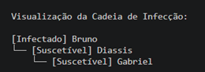
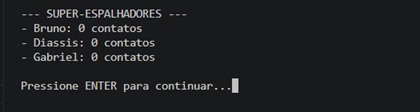
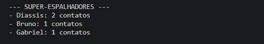

# G03_Grafos1_Rastreio_de_Contagios

**Conteúdo da Disciplina**: Grafos

## Alunos
|Matrícula | Aluno |
| -- | -- |
| 22/1008033  |  Fernando Gabriel Dos Santos Carrijo |
| 20/0035703  |  Breno Alexandre Soares Garcia |

## Sobre 
O projeto **Rastreio_de_Contágios** é uma ferramenta de modelagem epidemiológica baseada na teoria dos grafos. A dinâmica da aplicação consiste em cadastrar indivíduos (vértices) e registrar interações físicas entre eles (arestas não-direcionadas). 

O Grafo permite extrair métricas vitais para o controle de infecções:
* **Árvore de Infecção:** Utiliza o algoritmo de Busca em Largura (BFS) para visualizar a cadeia de transmissão a partir de um "paciente zero" e calcular o grau de exposição de indivíduos saudáveis.
* **Super-espalhadores:** Utiliza o cálculo de Centralidade de Grau para identificar os nós com o maior número de conexões, destacando indivíduos que exigem isolamento prioritário.

## Vídeo

Segue o vídeo feito pela dupla: [Link](https://www.youtube.com/watch?v=GbfybYKvnlw)

## Screenshots


> *Figura 1: Saída do terminal mostrando os super-espalhadores e a árvore de contágio.*


> *Figura 2: Validação da lógica estrutural através de testes .*


> *Figura 3: Validação da lógica estrutural através de testes .*

## Instalação 
**Linguagem**: `Python 3.8+`<br>
**Framework**: `Nenhum (Terminal)`<br>

**Pré-requisitos:**
É necessário ter o Python instalado na sua máquina. O projeto não utiliza bibliotecas externas, dependendo apenas de estruturas nativas (`collections`).

**Passo a passo da instalação:**

1. Clone este repositório:
```bash
git clone https://github.com/projeto-de-algoritmos-2026/G03_Grafos_Rastreio_de_Contagios
